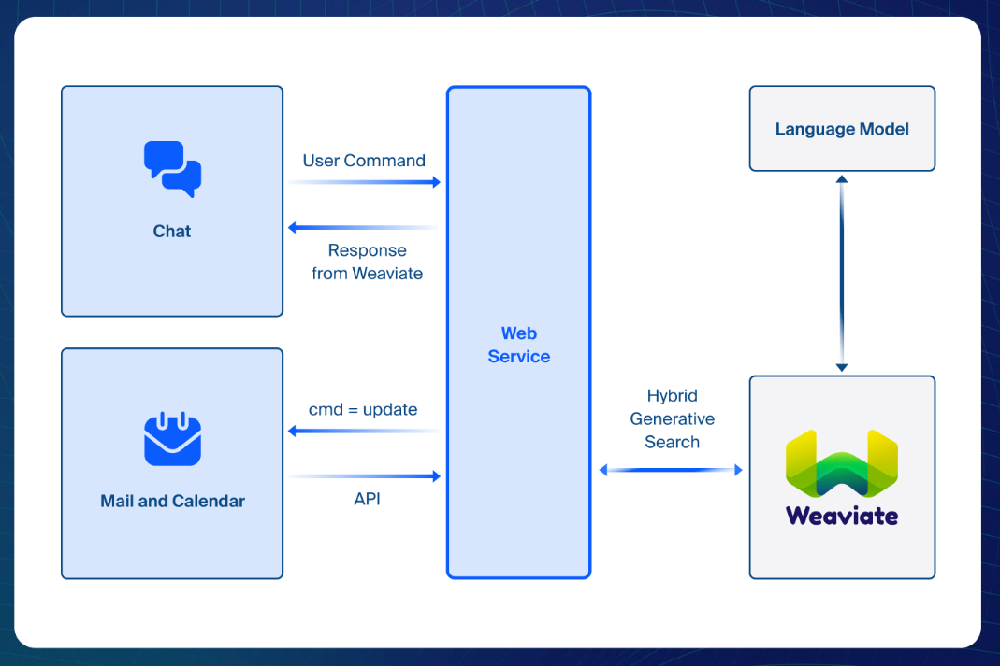

# Zooviate Chatbot on Zoom Teams Chat

This project contains two web services that speak to Zoom and Weaviate. You can find these projects in their respective folders. 

- zoom-server - is the NodeJS Zoom Web Service
- weaviate-server - is the Python Flask Weaviate Web Service.

Head on over to each project sub directory to learn more about how each project works. 

This project is a collaboration between Ojus Save and Adam Chan. Connect with us on LinkedIn and Twitter! 

* Ojus Save 
    * [LinkedIn](https://www.linkedin.com/in/ojus/)
    * [Twitter](https://x.com/ojusave)

* Adam Chan
    * [LinkedIn](https://linkedin.com/in/itsajchan)
    * [Twitter](https://twitter.com/itsajchan)
