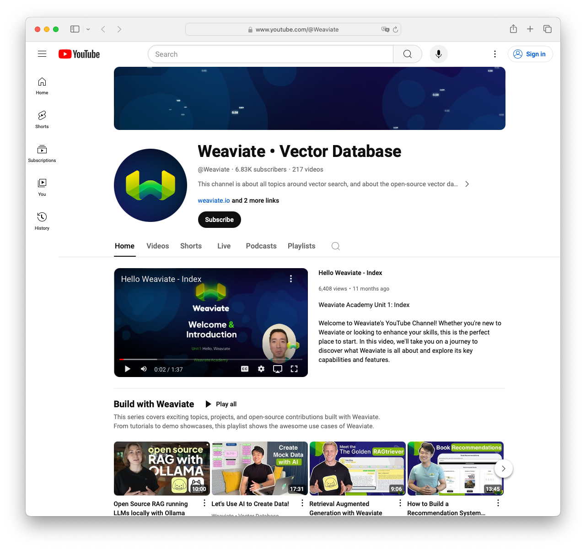

# Vector Embeddings API Server

This project provides a simple API server built with Flask, designed to store and query vector embeddings using Weaviate. It's an ideal starting point for developers looking to integrate vector search capabilities into their applications.

## Features

- **Store Vector Embeddings**: Allows storing vector embeddings in a Weaviate cluster.
- **Query Vector Embeddings**: Supports querying stored embeddings based on user input and return a chatbot response with the retrieved data

## Getting Started

### Prerequisites

- Python 3.6 or later
- Flask
- Weaviate Python client
- An active Weaviate Cloud Service (WCS) instance

## Usage

This project is a Flask application. Host it anywhere or use (ngrok)[https://ngrok.io] to expose it from your local environment.

Make sure you set up an python virtual enviroment and install the relevant deependencies:

    python3 -m venv venv
    source venv/bin/activate
    pip install -r requirements.txt


You'll need a Weaviate Cluster running, you can get one easily from [Weaviate Cloud](https://console.weaviate.cloud/).

Once you have a Weaviate Cluster you'll need to configure the environment, you can copy `sample.env` to `.env` and then insert the following details:

```
WCS_URL=...
WCS_API_KEY=...
OPENAI_APIKEY=...
```

This will allow you to connect to your Weaviate cluster to create a `Collection`. You can create your collection by running the following command from your shell where you've activated your virtual environment.

    pytho create_schema.py


The web service will attempt to vectorize all data you pass into the `/input`. When you query for your data, we apply a vector search to find similar items from the database, and then pass it to a language model, in this application we use gpt-4, to generate a message for the user.

### Store Data
To store vector embeddings:

```
curl -X POST http://127.0.0.1:5000/input -H "Content-Type: application/json" -d '{"your": "data"}'
```

### Query Data
To query stored embeddings:

```
curl -X POST http://127.0.0.1:5000/query -H "Content-Type: application/json" -d '{"message": "your query"}'
```


## Build more RAG projects today! 

If you enjoyed this project, check out some of our videos on the [Weaviate YouTube Channel!](https://www.youtube.com/@Weaviate)


